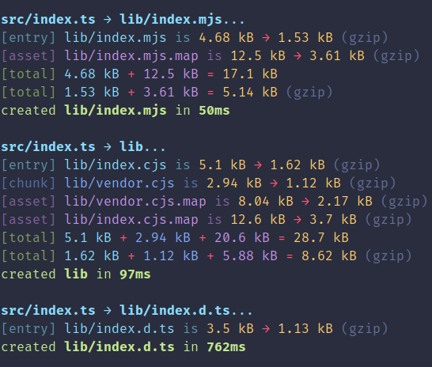

# rollup-plugin-output-size

[](https://www.npmjs.com/package/rollup-plugin-output-size)
[](https://github.com/Arnesfield/rollup-plugin-output-size/actions?query=workflow%3A"Node.js+CI")

A Rollup plugin that displays output bundle sizes.

> This project was inspired by [rollup-plugin-bundle-size](https://github.com/vimeo/rollup-plugin-bundle-size).



## Install

```sh
npm install --save-dev rollup-plugin-output-size
```

## Usage

```javascript
// ES6
import outputSize from 'rollup-plugin-output-size';

// CommonJS
const { outputSize } = require('rollup-plugin-output-size');
```

Use the plugin, example `rollup.config.js`:

```javascript
import outputSize from 'rollup-plugin-output-size';

export default {
  input: 'index.js',
  output: { dir: 'dist' },
  plugins: [outputSize(/* plugin options */)]
};
```

## Options

You can change and override the behavior of this plugin through its options. Note that all options are optional.

### hide

Type: `OutputType[]`

Specify which output types will not be displayed. Output types are: `asset`, `chunk`, and `entry`.

> Note: Both `chunk` and `entry` output types are `OutputChunk`s but `entry` chunks have `isEntry` values of `true`.

### gzip

Type: `boolean | OutputType[]`<br>
Default: `true`

Set to `false` to skip getting gzipped size, or set an array to only get gzipped sizes of specified output types.

### silent

Type: `boolean`<br>
Default: `false`

Disable output. This will also skip the [`handle`](#handle) callback.

### handle

Type: `(info: OutputInfo, output: OutputAsset | OutputChunk) => void | Promise<void>`

Override the default logging of output info.

The second argument `output` is the current Rollup output asset or chunk to log, while the first argument is the `OutputInfo`:

```typescript
/** Output info. */
export interface OutputInfo {
  /** Output path. */
  path: string;
  /** Output type. */
  type: OutputType;
  /** Output size. */
  size: number;
  /** Human readable output size. */
  hSize: string;
  /**
   * The gzipped size of the output. Provided
   * unless the `gzip` option is set to `false`.
   */
  gzip?: OutputInfoGzip;
}

/** Output info gzip. */
export interface OutputInfoGzip {
  /** The gzipped size. */
  size: number;
  /** Human readable gzipped size. */
  hSize: string;
}
```

## Other Utilities

This package also includes some utility functions that you may find helpful, especially when making use of the [`handle`](#handle) option.

### format

Type: `(info: OutputInfo) => string`

Used to get the default display format of output info.

```javascript
import outputSize, { format } from 'rollup-plugin-output-size';

export default {
  input: 'index.js',
  output: { dir: 'dist' },
  plugins: [
    outputSize({
      handle(info) {
        console.log(format(info));
      }
    })
  ]
};
```

```text
[{type}] {path} is {hSize} → {gzip.hSize} (gzip)
```

### gzip (util)

Type: `(input: string | Uint8Array) => Promise<OutputInfoGzip>`

Used to get the gzipped size of input.

```javascript
import outputSize, { gzip } from 'rollup-plugin-output-size';

export default {
  input: 'index.js',
  output: { dir: 'dist' },
  plugins: [
    outputSize({
      gzip: false,
      async handle(info, output) {
        const data = output.type === 'chunk' ? output.code : output.source;
        const gzipInfo = await gzip(data);
        console.log(info.path, gzipInfo);
      }
    })
  ]
};
```

## License

Licensed under the [MIT License](LICENSE).
